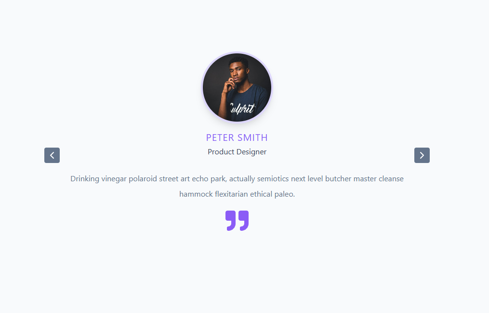

## Figma URL

[Slider](https://www.figma.com/file/QfMzzThSYmgabSvn4t8Yfe/Slider?node-id=0%3A1&t=IpsYjMUn3Xj3Hs3N-1)

## Slider App — Course Practice Project

This project was built to apply lessons learned from an online React course. It implements a simple carousel slider UI and demonstrates practical use of React concepts covered in the course.

**Topics covered:**

- **State management:** using `useState` to track the active slide and lists of items.
- **Side effects:** using `useEffect` for auto-play behavior and lifecycle-like effects.
- **Rendering data:** mapping arrays (from `data.js`) into slide components.
- **Functional components:** composing the UI from small, reusable functions.
- **Modulo operator:** used to wrap slide indices when navigating (ensures circular navigation).
- **Accessibility & UI polish:** keyboard navigation and clear focus states (basic), responsive layout.

**Notable implementation details**

- `Carousel.jsx` contains the core slider logic and renders slides from the `data.js` arrays.
- Auto-play is implemented with `useEffect` + `setInterval`, and cleanup is handled properly to avoid leaks.
- Navigation uses a simple index-based approach with modulo arithmetic to wrap around edges.
- Styling is plain CSS in `index.css` for clarity and easy learning.

Screenshot



Quick start

1. Install dependencies:

```bash
npm install
```

2. Start development server:

```bash
npm run dev
```

Files to inspect

- `src/Components/Carousel.jsx` — slider component and core logic.
- `src/data.js` — sample data used to render slides.
- `index.css` — styles for the carousel and layout.

Purpose

This repository is primarily an exercise project — a place to practice React hooks, component composition, and UI logic introduced in the course. It intentionally keeps dependencies minimal so learners can focus on core React patterns.

Questions or next steps

If you'd like, I can:

- Add keyboard controls or ARIA attributes for better accessibility.
- Add unit tests for navigation logic.
- Extract a minimal demo page to showcase the component.

Credits

Built while following an online React course — used for hands-on practice and experimentation.
